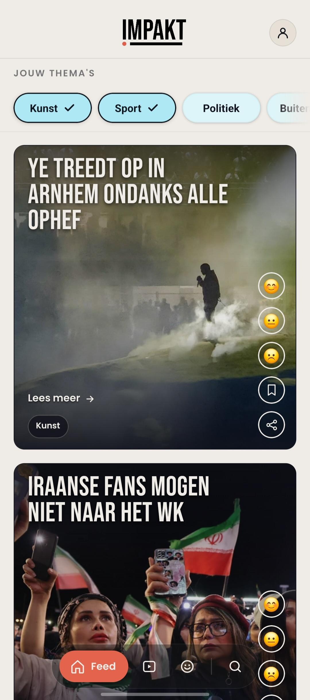
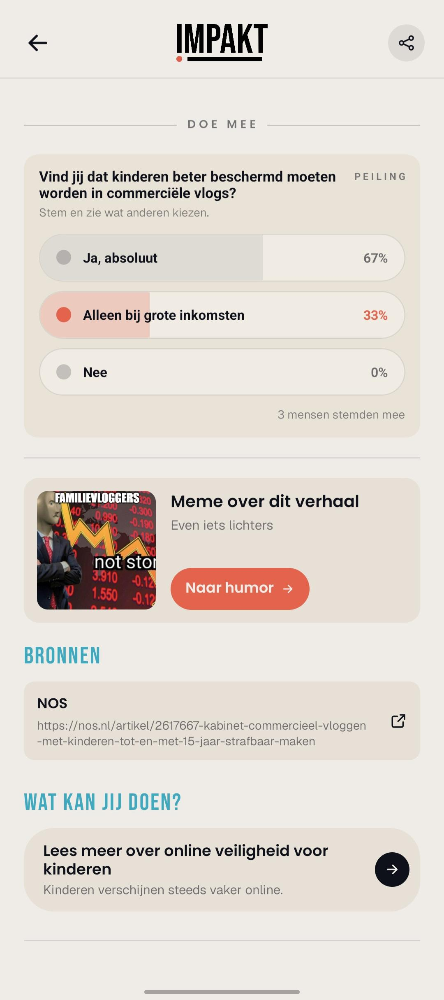

# Impakt

A visual news app for young people in the Netherlands, built with **React Native + Expo** (JavaScript). Impakt presents the news in a way that fits how young people scroll: a personal, image-driven **feed**, a separate **humor feed** with memes, a **Happy feed** with good news, and articles you can **react to, vote on, save, and share**.

The app runs against a live **Laravel backend** for content, reactions, and polls. Sharing is currently handled client-side (native Share / Web Share).

---

## Table of Contents

- [Screenshots](#screenshots)
- [Features](#features)
- [Tech Stack](#tech-stack)
- [Getting Started](#getting-started)
  - [Requirements](#requirements)
  - [Install and Run](#install-and-run)
  - [Simulators and Web](#simulators-and-web)
- [Configuration (`.env`)](#configuration-env)
- [Scripts](#scripts)
- [Project Structure](#project-structure)
- [Testing](#testing)
- [Contributing](#contributing)
- [Troubleshooting](#troubleshooting)
- [License](#license)

---

## Screenshots

|                        Feed                         |                          Humor                          |                         Happy feed                          |
| :-------------------------------------------------: | :-----------------------------------------------------: | :---------------------------------------------------------: |
|  |  |  |
|      Feed with theme filter and reaction rail       |              Meme feed with linked article              |                Separate stream of good news                 |

|                         Detail                         |                             Take part                             |
| :----------------------------------------------------: | :---------------------------------------------------------------: |
|  |  |
|           Detail page with reactions + save            |            Poll, "meme about this story," and sources             |

---

## Features

- **Personal feed** — stories filtered by your chosen themes (Arts, Sports, Politics, World, …).
- **Humor feed** — memes linked to their related news article.
- **Happy feed** — a separate stream of good news.
- **Reactions** — emoji reaction per article (😊 / 😐 / 🙁) with live percentages.
- **Save** — bookmark articles and find them back in your saved overview.
- **Share** — via the native share sheet (mobile) or Web Share / clipboard (web).
- **Polls** — vote inside an article and see the result instantly.
- **Sources & context** — every article shows source links and a "what can you do?" block.
- **Search** — search across all stories.
- **Account** — register, log in, and manage your profile.

---

## Tech Stack

- **Expo** SDK 54 + **React Native** 0.81.5 + React 19
- **Animations**: moti + react-native-reanimated 4
- **Navigation**: custom state machine in `App.jsx` (`phase` + `tab` + flags — no React Navigation)
- **Storage**: AsyncStorage (preferences, saved articles)
- **Backend**: Laravel API (REST), base URL via `EXPO_PUBLIC_API_BASE_URL`
- **Fonts**: Bebas Neue, Poppins, Geist (via expo-google-fonts)
- **Tests**: Jest + jest-expo + Testing Library; Playwright (e2e web target)
- **Web deploy**: `expo export` → static `dist/` on the Laravel server (same-origin `/api`)

---

## Getting Started

### Requirements

- **Node 20+** and npm
- **Expo Go** on your phone ([iOS](https://apps.apple.com/app/expo-go/id982107779) / [Android](https://play.google.com/store/apps/details?id=host.exp.exponent)) — to run on your own device
- Xcode (iOS simulator) or Android Studio (Android emulator) — optional, only for the simulator

### Install and Run

```bash
git clone https://github.com/AirMile/impakt.git
cd impakt-rn
npm install
cp .env.example .env   # set the API base URL (see below)
npm run start
```

A QR code appears in the terminal:

- **Android**: scan it with the camera inside the Expo Go app
- **iOS**: scan it with the default Camera app

The app then opens directly on your phone.

### Simulators and Web

```bash
npm run ios        # iOS simulator (requires Xcode on macOS)
npm run android    # Android emulator (requires Android Studio)
npm run web        # web version at http://localhost:3000
```

The web version runs at `http://localhost:3000`, because the backend CORS policy allows this origin.

---

## Configuration (`.env`)

The app talks to the Laravel backend via `EXPO_PUBLIC_API_BASE_URL`. It lives in `src/lib/config.js` and falls back to the dev backend IP without a `.env`, so tests and CI keep working.

```bash
cp .env.example .env
```

```dotenv
# Local dev (native + web) talks directly to the backend:
EXPO_PUBLIC_API_BASE_URL=http://145.24.237.97/api
```

> **Note:** after changing `.env`, restart the dev server with a cache clear:
>
> ```bash
> npx expo start -c
> ```

For the hosted web build, `.env.production` is used (`/api` relative). The static build is served from the same server as the Laravel backend, so the app calls the API same-origin via `/api` — no CORS, no proxy. See `docs/backend.md` for the full API spec and hosting steps.

---

## Scripts

| Command              | What it does                                           |
| -------------------- | ------------------------------------------------------ |
| `npm run start`      | Start the Expo dev server (Expo Go / dev client)       |
| `npm run ios`        | Start the app in the iOS simulator                     |
| `npm run android`    | Start the app in the Android emulator                  |
| `npm run web`        | Start the app as a web app via react-native-web        |
| `npm run export:web` | Build the static web build to `dist/` (for the server) |
| `npm run lint`       | Lint via ESLint 10                                     |
| `npm run format`     | Format code via Prettier 3                             |
| `npm run test`       | Run unit tests via Jest                                |

---

## Project Structure

```
App.jsx                # entry point — navigation via state (phase, tab, flags)
src/
  screens/             # FeedScreen, HumorScreen, HappyFeedScreen, DetailScreen,
                       #   SearchScreen, SavedScreen, ProfileScreen, AuthScreen
  components/          # BottomNav, ReactionRail, AppHeader, Icons, ImpaktLogo, ...
  hooks/               # useArticleReactions, useAsyncData, useSaveArticle
  lib/                 # pure helpers: articles, filterStories, config, auth/, ...
  api/mock/            # fixtures for tests (stories/memes/categories)
  storage/             # AsyncStorage helpers for preferences
  theme/               # color and font tokens, animation helpers
docs/
  backend.md           # API spec for the backend team
  screenshots/         # images for this README
e2e/
  feed-smoke.js        # Playwright smoke test (web target)
```

---

## Testing

```bash
npm run test          # all unit tests (Jest + jest-expo)
```

Pure helpers in `src/lib/` have unit tests; components and hooks have render + interaction tests via Testing Library. Every new or changed feature comes with a test — a feature is only done when the test passes.

---

## Contributing

- Work in a feature branch (`feat/...`, `fix/...`) and open a PR against `dev`.
- Before opening a PR, run: `npm run lint && npm run format && npm run test`.
- Commit messages follow the [Conventional Commits](https://www.conventionalcommits.org/) style (`feat(...)`, `fix(...)`, …).

---

## Troubleshooting

**Phone cannot load the app ("Network response timed out")**
Make sure your phone and laptop are on the same Wi-Fi network. Alternatively, use the tunnel option: press `t` in the terminal after `npm run start`.

**No data / empty feed**
Check that `EXPO_PUBLIC_API_BASE_URL` in your `.env` points to a reachable backend, and restart with `npx expo start -c`.

**Reanimated or worklets error on startup**
Clear the Metro cache:

```bash
npx expo start --clear
```

---

## License

MIT — see [`LICENSE`](LICENSE).
